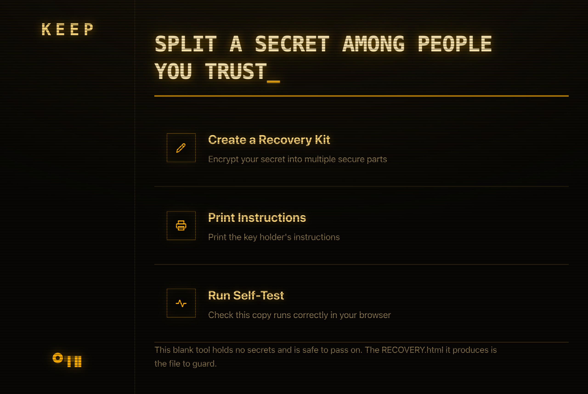
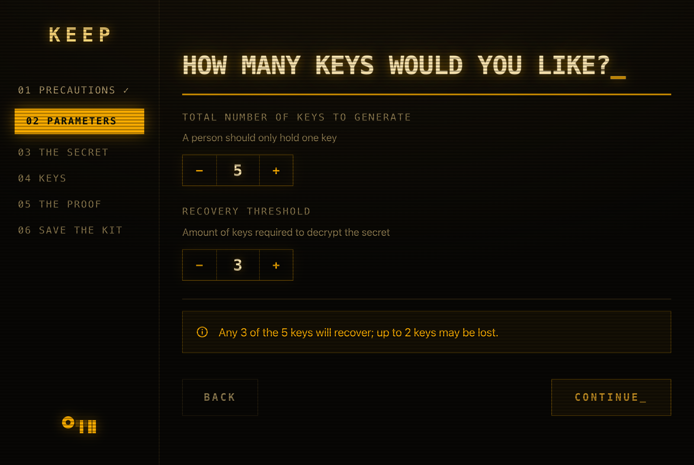
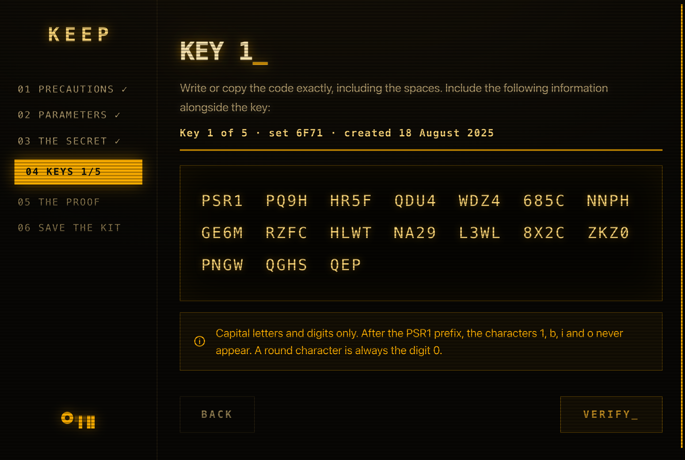
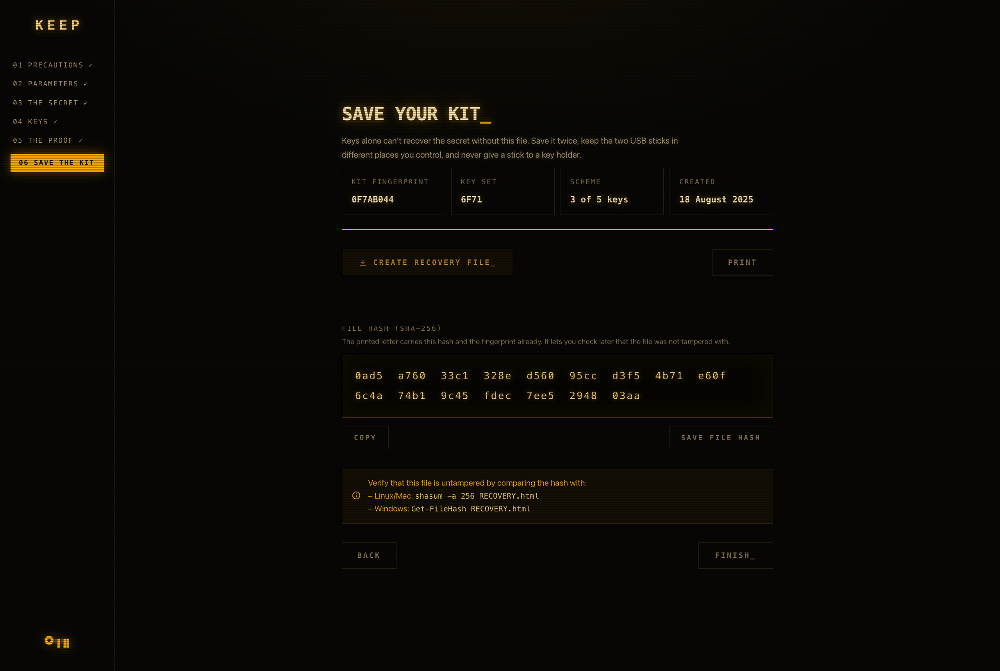
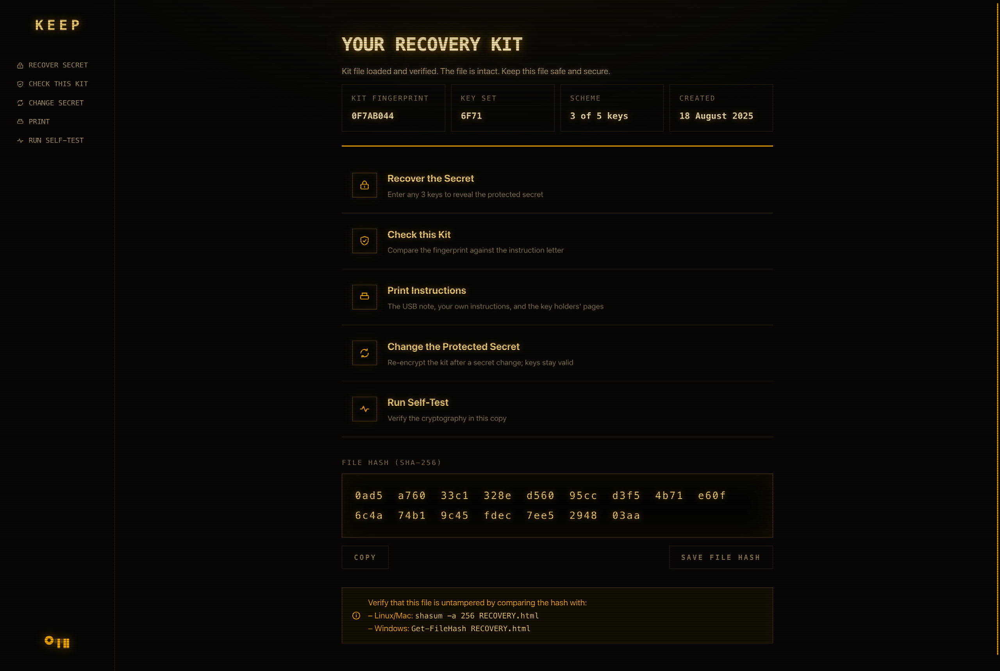
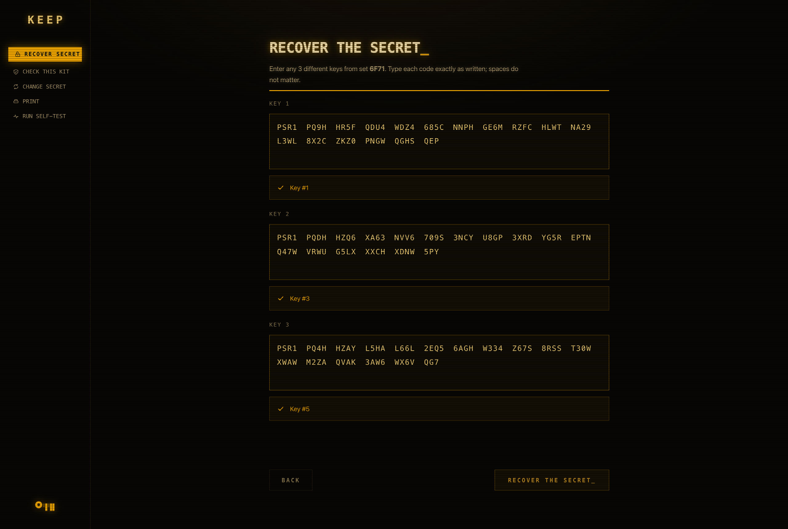
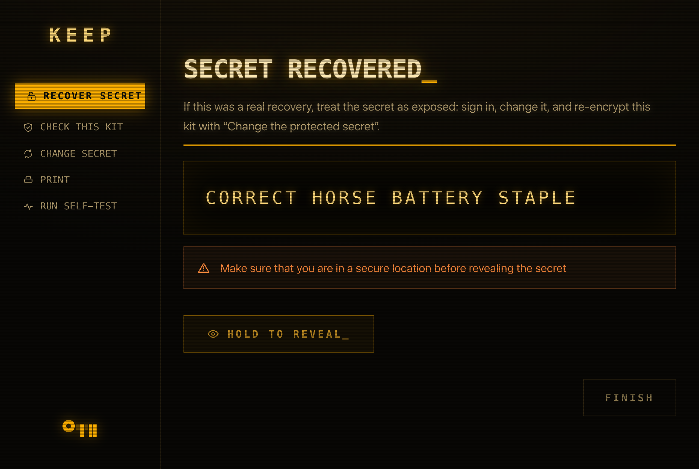

# KEEP

[](https://github.com/leonjbdb/KEEP/actions/workflows/test.yml)
[](LICENSE)


<br>

> [!WARNING]
> Never trust cryptographic tools online before verifying them yourself.
> This one included. Do your due diligence before using this kind of tool.

<!-- BEGIN BUILD-HASH -->

`dist/keep.html` — SHA-256

```
91ae2931ce626b46f61c42b77ef0eebf225f7e9ed69de677f0f93b44f1fa99c8
```

<!-- END BUILD-HASH -->

*This is the hash of the current build. How to check it: [Verify the tool](#verify-the-tool).*

<br>

Quorum recovery tool for a secret, packed into a single HTML file.

---

## Contents

- [How it works](#how-it-works)
- [Screenshots](#screenshots)
- [Use](#use)
- [Verify the tool](#verify-the-tool)
- [Design notes](#design-notes)
- [Tests](#tests)
- [License](#license)

<br>

<p align="center">
  
</p>

---

## How it works

Create n decryption keys you give to people you trust, to store securely.
Any k of the keys (default 3 of 5), typed into the kit file you generate,
will recover the secret you input. Fewer than k keys will not suffice to
decrypt the secret, because the split uses Shamir secret sharing. The kit
file on its own is also useless; it holds AES-256 ciphertext plus one
half of the decryption key, and the other half only exists spread
across n people you trust. This makes sure that those people can't
decrypt the secret without your recovery kit, and your recovery kit
doesn't work without your trusted people's keys.

- If you were to die or otherwise become permanently incapacitated,
  your next of kin will get hold of your recovery key and with instructions
  be able to decrypt the secret.
- If you were to forget your password, for example due to an accident,
  you are able to recover the secret through your trusted people.

---

## Screenshots

The ceremony in `keep.html`:

<table>
  <tr>
    <td align="center"><br><sub>Choosing the number of keys and the threshold</sub></td>
    <td align="center"><br><sub>Keys are shown one at a time for writing down</sub></td>
  </tr>
  <tr>
    <td colspan="2" align="center"><br><sub>Saving the kit, with its fingerprint and SHA-256 file hash</sub></td>
  </tr>
</table>

The personalized `RECOVERY.html` the ceremony produces (shown here
with a demo vault, not a real kit):

<table>
  <tr>
    <td align="center"><br><sub>Recovery kit home: fingerprint, key set, and scheme</sub></td>
    <td align="center"><br><sub>Each entered key is validated against its stored commitment</sub></td>
  </tr>
  <tr>
    <td colspan="2" align="center"><br><sub>The recovered secret behind a hold-to-reveal button</sub></td>
  </tr>
</table>

---

## Use

```
node build.mjs
```

Produces `dist/keep.html`.

> [!IMPORTANT]
> [Verify the tool](#verify-the-tool) — Always verify the file before use

Create a kit and follow the wizard. The ceremony ends with a
personalized `RECOVERY.html` (app and encrypted vault in one file) that
is stored in a secure but retrievable place (two USB sticks is recommended).
The full runbook is in [docs/CEREMONY-CHECKLIST.md](docs/CEREMONY-CHECKLIST.md).

The blank tool contains no secrets, so you can pass it on to friends or family
who want their own kit, or better yet to this repository. Every ceremony generates fresh keys.

---

## Verify the tool

Check the hash of `keep.html` every time, before every ceremony. The
one you built yourself included. A tampered build could copy your
password elsewhere without your knowledge, and the self-test inside the file
cannot tell you the file itself wasn't modified: a modified file can lie about
itself just as easily.

Building it yourself proves what the bytes were when you built them. It
says nothing about what they are now. Files sit on disk, get copied to
sticks, sync to somewhere, and get opened again months later. The check
costs one command, so there is no version of this worth skipping.
The current build's hash is at the [top of this README](#keep).

The build is deterministic — the same source produces
the same bytes — so you don't have to trust the number: rebuild and
compare. Release tags are signed, so `git tag -v <tag>` tells you the
source you're building is untampered.

Check with the hashing tool your OS already ships. Compare what it
prints against the hash above — every character, not just the first
and last few.

**macOS and Linux**:

```bash
shasum -a 256 keep.html
```

**Windows**:

```powershell
Get-FileHash keep.html
```

`Get-FileHash` prints uppercase and `shasum` prints lowercase; only the
case differs, so compare them case-insensitively.

Same discipline for the `RECOVERY.html`.

---

## Design notes

- password → AES-256-GCM under `HKDF(K_app ‖ K_share)`. `K_app` lives
  in the kit file, `K_share` is Shamir-split k-of-n over GF(256) into
  the keys.
- Keys are 67-character bech32m strings. The checksum catches typos
  of up to four characters, and error messages name the exact key
  that's wrong (the kit stores a commitment per key).
- Changing the password re-encrypts the kit file only. Keys never
  change unless you re-run the ceremony.
- The wizard makes you re-type every key you have copied or written,
  and run one real recovery from your copied or written keys before it lets you save.
  Untested paper backups are how these schemes usually die.
- No dependencies, one HTML file using WebCrypto plus about 700
  lines of vendored code. `build.mjs` fails the build if anything
  network-shaped sneaks in.

The byte-level format, with enough detail to recover without any of
this code, is in [docs/RECOVERY-SPEC.md](docs/RECOVERY-SPEC.md).
[tools/recover.py](tools/recover.py) is a working reference in plain
Python, tested against the same frozen vector as the JS.
Tampering with a RECOVERY.html (app code included) is detectable by
comparing its SHA-256 against the hash recorded on the instruction
letter, using the hashing tool every OS already ships — `shasum -a 256`
on macOS and Linux, `Get-FileHash` in Windows PowerShell. The check has
to come from outside the file, since a tampered file could lie about
its own hash. The hash changes with every password rotation; the app
shows the new one each time it saves.

---

## Tests

```
node --test "test/*.test.mjs"
```

Known-answer vectors (GF(256), HKDF, AES-GCM, bech32m), a frozen golden
vault as the compatibility contract, recovery across every k-key
combination, key corruption detection, a tamper matrix over every
region of the vault file, build lint, and a JS-to-Python cross-check.

---

## License

[MIT](LICENSE) — use it, copy it, change it, ship it, sell it, with or
without attribution in your own product. The only condition is that the
copyright notice and permission text travel with substantial copies of
the source.

Because `keep.html` is the thing people actually pass around, the notice
and the full licence text are built into the file itself: whoever ends
up with a copy on a USB stick already has everything the licence asks
them to keep. The same is true of the `RECOVERY.html` a ceremony
produces.

There is no warranty. This is cryptographic software that stands between
someone and their password — read it, test it, and decide for yourself
whether to trust it with something that matters.
