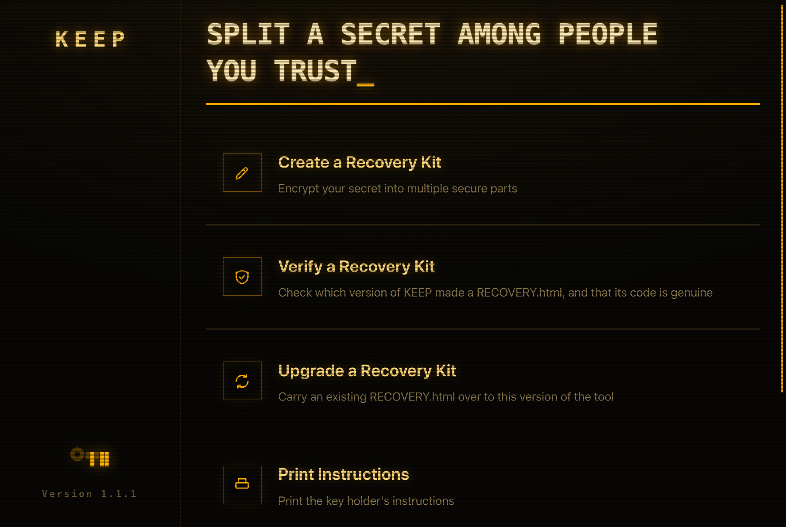
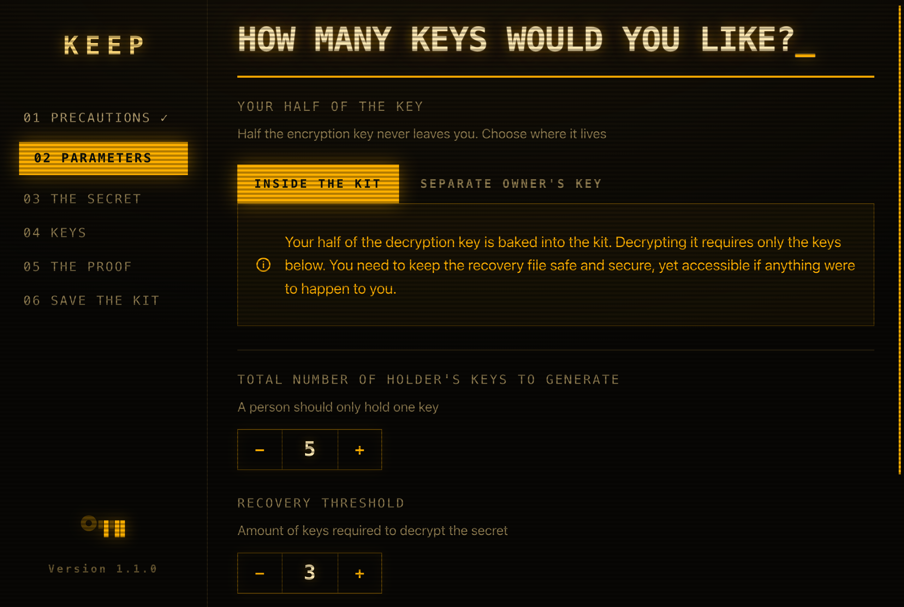
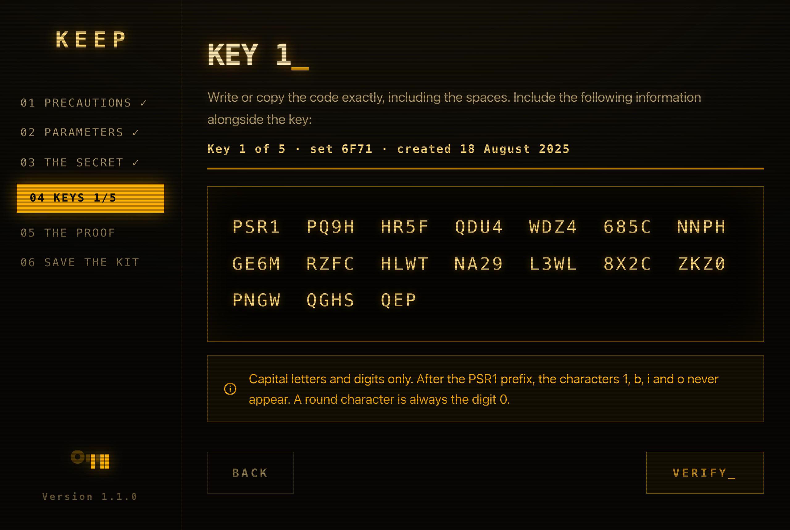
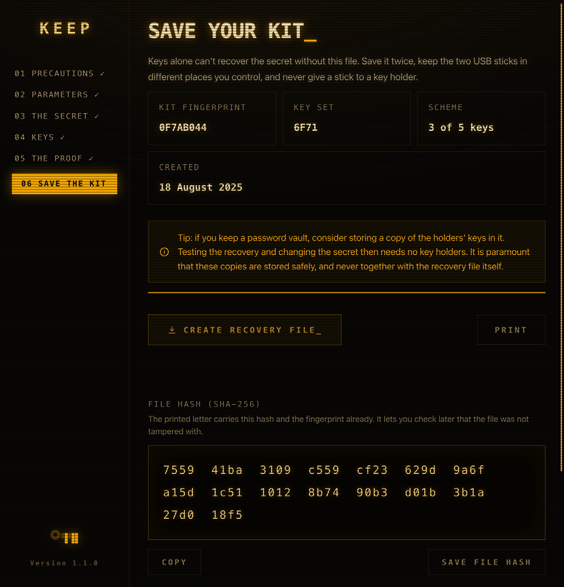
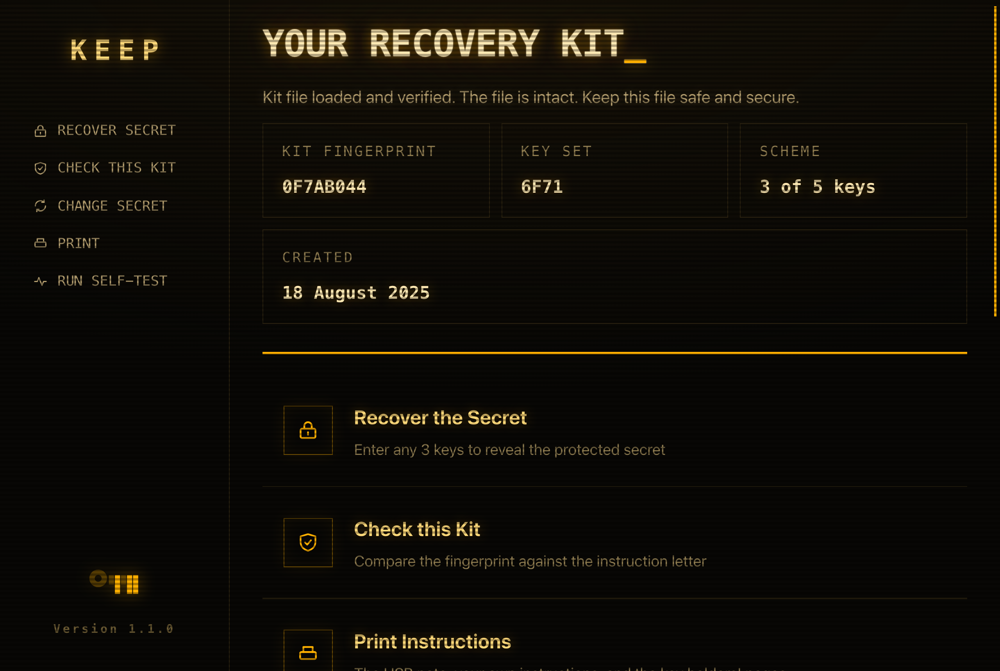
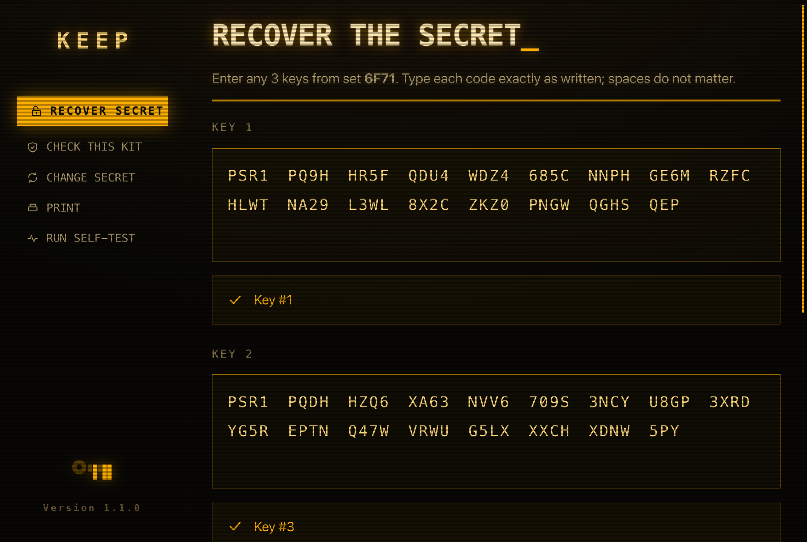
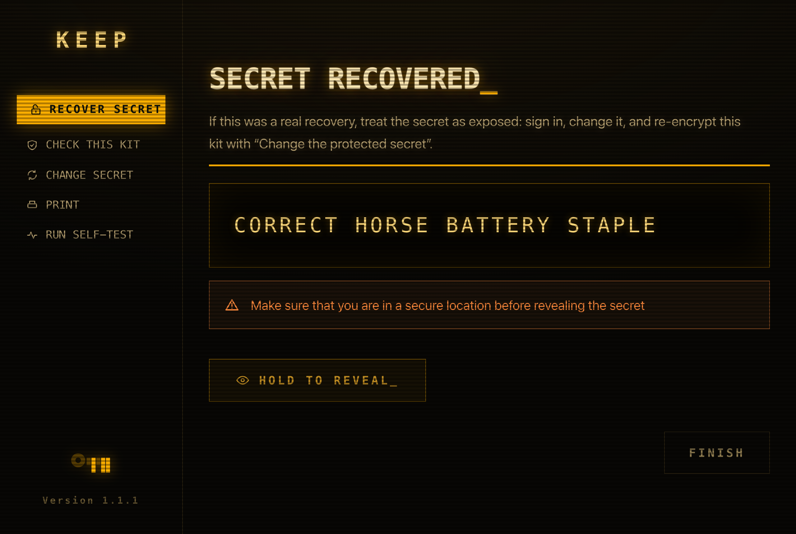

# KEEP

[](https://github.com/leonjbdb/KEEP/actions/workflows/test.yml)
[](LICENSE)


<br>

> [!WARNING]
> Never trust cryptographic tools online before verifying them yourself.
> This one included. Do your due diligence before using this kind of tool.

<!-- BEGIN BUILD-HASH -->

`dist/keep.html` — SHA-256

```
2eaef4016f7bf9eaecf379cb269d9f65332e976ebd6abbf503930f4d5c587d6d
```

<!-- END BUILD-HASH -->

*This is the hash of the current build. How to check it: [Verify the tool](#verify-the-tool).*

<br>

Quorum recovery tool for a secret, packed into a single HTML file.

---

## Contents

- [How it works](#how-it-works)
- [Screenshots](#screenshots)
- [Use](#use)
- [Verify the tool](#verify-the-tool)
- [Design notes](#design-notes)
- [Tests](#tests)
- [License](#license)

<br>

<p align="center">
  
</p>

---

## How it works

Create n decryption keys you give to people you trust, to store securely.
Any k of the keys (default 3 of 5), typed into the kit file you generate,
will recover the secret you input. Fewer than k keys will not suffice to
decrypt the secret, because the split uses Shamir secret sharing. The kit
file on its own is also useless; it holds AES-256 ciphertext plus one
half of the decryption key, and the other half only exists spread
across n people you trust. This makes sure that those people can't
decrypt the secret without your recovery kit, and your recovery kit
doesn't work without your trusted people's keys.

- If you were to die or otherwise become permanently incapacitated,
  your next of kin will get hold of your recovery key and with instructions
  be able to decrypt the secret.
- If you were to forget your password, for example due to an accident,
  you are able to recover the secret through your trusted people.

Optionally, the ceremony can keep your half of the key **out of the kit
file** as a separate *owner's key* (a `KEEP1…` code you store yourself).
Recovery then needs the kit file, the owner's key **and** k of the n keys
— copies of the kit file can live anywhere without ever letting the
key holders decrypt on their own. Because the owner's key is itself a
required factor, such a kit may use schemes as small as 1-of-1 — a
single holder — where the standard kit requires at least 2-of-2. The
trade-off: losing the owner's key makes the secret unrecoverable, no
matter how many holders remain.

---

## Screenshots

The ceremony in `keep.html`:

<table>
  <tr>
    <td align="center"><br><sub>Choosing the number of keys and the threshold</sub></td>
    <td align="center"><br><sub>Keys are shown one at a time for writing down</sub></td>
  </tr>
  <tr>
    <td colspan="2" align="center"><br><sub>Saving the kit, with its fingerprint and SHA-256 file hash</sub></td>
  </tr>
</table>

The personalized `RECOVERY.html` the ceremony produces (shown here
with a demo vault, not a real kit):

<table>
  <tr>
    <td align="center"><br><sub>Recovery kit home: fingerprint, key set, and scheme</sub></td>
    <td align="center"><br><sub>Each entered key is validated against its stored commitment</sub></td>
  </tr>
  <tr>
    <td colspan="2" align="center"><br><sub>The recovered secret behind a hold-to-reveal button</sub></td>
  </tr>
</table>

---

## Use

```
node build.mjs
```

Produces `dist/keep.html`.

> [!IMPORTANT]
> [Verify the tool](#verify-the-tool) — Always verify the file before use

Create a kit and follow the wizard. The ceremony ends with a
personalized `RECOVERY.html` (app and encrypted vault in one file) that
is stored in a secure but retrievable place (two USB sticks is recommended).
The full runbook is in [docs/CEREMONY-CHECKLIST.md](docs/CEREMONY-CHECKLIST.md).

The blank tool contains no secrets, so you can pass it on to friends or family
who want their own kit, or better yet to this repository. Every ceremony generates fresh keys.

An existing `RECOVERY.html` can be carried over to a newer build: open the
new blank `keep.html`, choose *Upgrade a Recovery Kit*, and pick the old
file. The vault inside is copied over verbatim — keys, owner's key,
secret, and kit fingerprint all unchanged, no keys needed — as long as
the new tool declares itself compatible with the file's format version
(each build lists the formats it supports and refuses anything newer).
Only the app code around the vault changes, so the file hash changes:
note the new hash, and print a fresh letter from the upgraded file.

A `RECOVERY.html` can also be checked without opening it: in the blank
`keep.html`, choose *Verify a Recovery Kit* and pick the file. The tool
names the release whose code the file carries, checks the vault inside,
and shows the file's hash to compare with the printed letter. Nothing is
decrypted and no keys are needed. See [Verify a kit](#verify-a-kit).

Every build also drops `dist/RECOVERY-demo-v<version>.html` — the frozen
golden test vault wrapped in that exact build, for checking what a
personalized kit looks and behaves like. Its password and keys are
published in `test/vault.test.mjs`, so it is a demo by construction and
must never hold a real secret. The build removes stale demo kits, so
`dist/` never carries two versions side by side.

---

## Verify the tool

Check the hash of `keep.html` every time, before every ceremony. The
one you built yourself included. A tampered build could copy your
password elsewhere without your knowledge, and the self-test inside the file
cannot tell you the file itself wasn't modified: a modified file can lie about
itself just as easily.

Building it yourself proves what the bytes were when you built them. It
says nothing about what they are now. Files sit on disk, get copied to
sticks, sync to somewhere, and get opened again months later. The check
costs one command, so there is no version of this worth skipping.
The current build's hash is at the [top of this README](#keep).

The build is deterministic — the same source produces
the same bytes — so you don't have to trust the number: rebuild and
compare. Release tags are signed, so `git tag -v <tag>` tells you the
source you're building is untampered.

Check with the hashing tool your OS already ships. Compare what it
prints against the hash above — every character, not just the first
and last few.

**macOS and Linux**:

```bash
shasum -a 256 keep.html
```

**Windows**:

```powershell
Get-FileHash keep.html
```

`Get-FileHash` prints uppercase and `shasum` prints lowercase; only the
case differs, so compare them case-insensitively.

Same discipline for the `RECOVERY.html`.

### Verify a kit

A `RECOVERY.html` is `keep.html` with exactly two spans changed: the
vault block's payload (`null` becomes the encrypted vault) and the
`<title>`. Since 1.1.0 the app writes kits from a copy of itself that
is byte for byte the file it was opened from, so the change is
reversible: put `null` and `KEEP — Create Recovery Kit` back, and a
genuine kit is the exact `keep.html` of its release, with the hash that
release published.

*Verify a Recovery Kit* in `keep.html` does that for you. Every build
carries the published hash of every release before it
(`src/releases.js`), so a `keep.html` downloaded years from now still
recognises a kit made today, and says which version made it. A kit
whose code matches no release is reported as not verified; upgrading it
with a verified `keep.html` puts known code back around the same vault.

Only tagged releases are listed; development builds are never vouched
for. A kit made by the very `keep.html` doing the check is recognised
as its own code, which is the published release only if that
`keep.html` is: the check is only as good as the file doing it, so
verify that file first, as above.

The self-test's *Exact Copy* check confirms the browser copies the file
faithfully, which is what makes the kits it writes verifiable later.
The screens that write a kit (create, change the secret, upgrade) warn
before you start if it does not hold.

Kits from 1.0.x predate this and were written from a re-serialized
copy of the page. Their hashes are listed too, as Chrome serializes
those releases; a 1.0.x kit made in another browser may not match.

---

## Design notes

- password → AES-256-GCM under `HKDF(K_app ‖ K_share)`. `K_app` lives
  in the kit file (format v1) or on a separate `KEEP1…` owner's key
  (format v2, chosen at the ceremony; the file then stores only a
  commitment to it), `K_share` is Shamir-split k-of-n over GF(256) into
  the keys.
- Keys are 67-character bech32m strings. The checksum catches typos
  of up to four characters, and error messages name the exact key
  that's wrong (the kit stores a commitment per key).
- Changing the password re-encrypts the kit file only. Keys never
  change unless you re-run the ceremony.
- The wizard makes you re-type every key you have copied or written,
  and run one real recovery from your copied or written keys before it lets you save.
  Untested paper backups are how these schemes usually die.
- No dependencies, one HTML file using WebCrypto plus about 700
  lines of vendored code. `build.mjs` fails the build if anything
  network-shaped sneaks in.
- Each release lists the published hash of every earlier release in
  `src/releases.js`, so newer builds can verify older kits. A build
  can't list itself; when the next version is prepared, the previous
  release's hash is added, and the tests fail until it is. The build
  also stamps each file with its own hash taken with that stamp left
  empty (`BUILD_DIGEST`), which is what the *Exact Copy* self-test
  checks against.
- The tool version is pinned in the source (`APP_VERSION` in
  `src/app.js`), never stamped in from git: the build must stay
  reproducible from the source alone, with no `.git` around. The tie to
  git runs the other way — the build fails when a clean checkout sits on
  a `v*` tag that disagrees with the source (locally via `git describe`,
  in CI via the ref), so a release can never ship a version string that
  contradicts its tag.

The byte-level format, with enough detail to recover without any of
this code, is in [docs/RECOVERY-SPEC.md](docs/RECOVERY-SPEC.md).
[tools/recover.py](tools/recover.py) is a working reference in plain
Python, tested against the same frozen vector as the JS. Both travel
inside every `keep.html` and `RECOVERY.html` as an HTML comment, so the
one file is enough even where no browser runs it: open it in a text
editor and search for `MANUAL RECOVERY`.
Tampering with a RECOVERY.html (app code included) is detectable by
comparing its SHA-256 against the hash recorded on the instruction
letter, using the hashing tool every OS already ships — `shasum -a 256`
on macOS and Linux, `Get-FileHash` in Windows PowerShell. The check has
to come from outside the file, since a tampered file could lie about
its own hash. The hash changes with every password rotation; the app
shows the new one each time it saves.

---

## Tests

```
node --test "test/*.test.mjs"
```

Known-answer vectors (GF(256), HKDF, AES-GCM, bech32m), a frozen golden
vault as the compatibility contract, recovery across every k-key
combination, key corruption detection, a tamper matrix over every
region of the vault file, build lint, and a JS-to-Python cross-check.

The browser suite drives headless Chrome through the real file: the blank
tool upgrades the demo kit, then the kit it wrote is opened, checked
against its own hash, self-tested, and recovered through the interface.
It also runs *Verify a Recovery Kit* over genuine, tampered, damaged and
older kits, and checks that Chrome reproduces every hash in
`src/releases.js` from the files published at the release tags. The
Python tests cut `recover.py` out of a kit's manual recovery comment and
recover that kit with it.
It needs Chrome or Chromium installed (or `CHROME_PATH`); without one it
reports itself skipped locally, and fails in CI.

---

## License

[MIT](LICENSE) — use it, copy it, change it, ship it, sell it, with or
without attribution in your own product. The only condition is that the
copyright notice and permission text travel with substantial copies of
the source.

Because `keep.html` is the thing people actually pass around, the notice
and the full licence text are built into the file itself: whoever ends
up with a copy on a USB stick already has everything the licence asks
them to keep. The same is true of the `RECOVERY.html` a ceremony
produces.

There is no warranty. This is cryptographic software that stands between
someone and their password — read it, test it, and decide for yourself
whether to trust it with something that matters.
